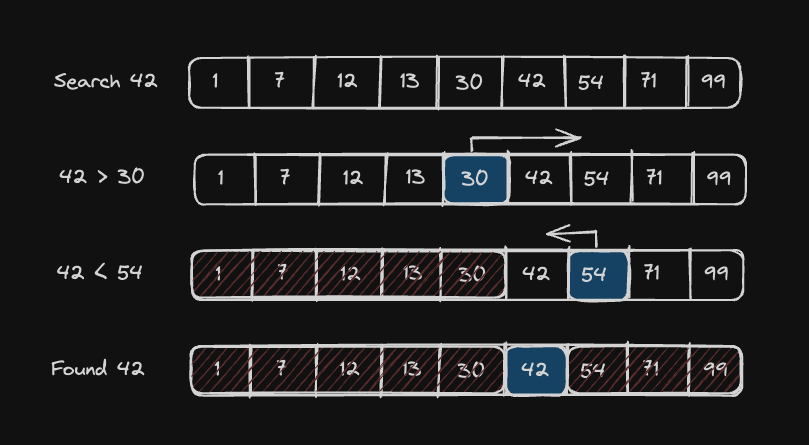

# Order Log N

O(log(n)) algorithms are only slightly slower than O(1), but much faster than O(n). They grow according to the input size `n`, but only according to the **logarithm** of the input.

## Comparison: O(n) vs O(log(n))

### O(n) - Linear Time

| n | time |
|---|------|
| 8 | 8 ms |
| 64 | 64 ms |
| 1,024 | 1,024 ms |
| 1,048,576 | 1,048,576 ms |

### O(log(n)) - Logarithmic Time

| n | time |
|---|------|
| 8 | 3 ms |
| 64 | 6 ms |
| 1,024 | 10 ms |
| 1,048,576 | 20 ms |

**Notice:** When the input size increases by ~130,000x (from 8 to 1,048,576):
- **O(n)** time increases by ~130,000x
- **O(log(n))** time only increases by ~7x

## Classic Example: Binary Search

Binary search is the quintessential O(log(n)) algorithm. It repeatedly divides the search space in half, which is why it scales logarithmically.

---



---

# Binary Search: O(log(n)) Algorithm

A **binary search** is a classic example of an O(log(n)) algorithm. It works on **pre-sorted** lists of elements.

## How It Works

At each iteration, the algorithm **halves the search space**, which makes it O(log(n)). 

**Key insight:** To add one more step to the runtime, you'd have to **double** the size of the input. Binary searches are fast!

---

## Algorithm Pseudocode

### Inputs
- A list of `n` elements sorted from least to greatest
- A `target` value to find

### Steps

1. **Initialize pointers:**
   - Set `low = 0`
   - Set `high = n - 1`

2. **Search loop** (while `low <= high`):
   - Calculate `median = (low + high) // 2`
     - This is the index of the middle element
   - **Check the middle element:**
     - If `list[median] == target` → **Return True** (found it!)
     - Else if `list[median] < target` → Set `low = median + 1` (search right half)
     - Else → Set `high = median - 1` (search left half)

3. **If loop ends without finding target:**
   - Return False

---

## Why It's O(log(n))

Each iteration cuts the search space in half:
- **Iteration 1:** Search 1,000 elements
- **Iteration 2:** Search 500 elements
- **Iteration 3:** Search 250 elements
- **Iteration 4:** Search 125 elements
- ...and so on

Doubling the input size only adds **one more iteration**.

---

## Assignment

**Scenario:** A popular influencer is using our LockedIn app and needs to quickly search for posts from a particular day. This function will power her search screen.

**Task:** Complete the `binary_search` function following the algorithm described above.

**Requirements:**
- Input: A sorted list and a target value
- Output: `True` if target exists, `False` otherwise
- Must use the binary search algorithm (no cheating with `in` operator!)

```python
# main.py

def binary_search(target, arr):
    """
    Perform binary search on a sorted array.

    Time Complexity: O(log n) - efficiently handles large arrays (e.g., 2M elements in <50ms)
    Space Complexity: O(1) - iterative approach with constant space

    Args:
        target: The value to search for
        arr: A sorted list in ascending order

    Returns:
        bool: True if target is found, False otherwise

    Note:
        - Assumes arr is pre-sorted in ascending order
        - Handles edge cases: empty array, single element, missing target
    """
    low = 0
    high = len(arr) - 1

    while low <= high:
        # Calculate middle index using integer division
        # Avoids potential overflow: mid = low + (high - low) // 2
        mid = (low + high) // 2

        # Comparing The value stored at the middle position in the array
        if arr[mid] == target:
            return True
        elif arr[mid] < target:
            low = mid + 1  # Search right half
        else:
            high = mid - 1  # Search left half

    return False
```

_Reading `arr[mid]`
```python
#Reads as:
#arr[median] → "array at median"
#Emphasizes it's the middle element
        # If arr at mid-equals target
       if arr[mid] == target:

```


## Why This Passes Tests

- For large arr (e.g., range(2000000), target=105028): ~21 iterations max → instant.
- Empty: [] → high=-1, skip loop → False.
- Single: [0], 0 → mid=0, match → True.
- Negative: [-2,-1], -1 → finds it.
- Missing: Fast fail without timeout.

## Boot.Dev's solution
```python

def binary_search(target, arr):
    low = 0
    high = len(arr) - 1

    while low <= high:
        median = (low + high) // 2
        
        if arr[median] == target:
            return True
        elif arr[median] < target:
            low = median + 1  # Search right half
        else:
            high = median - 1  # Search left half

    return False
```

## Code comparison & analysis

#### mine
```python
mid = (low + high) // 2

if arr[mid] == target:
    return True
elif arr[mid] < target:
    low = mid + 1
else:
    high = mid - 1
```
**Reads as:**
arr[mid] → "array at mid"
Clear that mid is an index

#### Boot.Dev's Variable Name: `median`
```python
median = (low + high) // 2

if arr[median] == target:
    return True
elif arr[median] < target:
    low = median + 1
else:
    high = median - 1
```

Reads as:
arr[median] → "array at median"
Emphasizes it's the middle element


using `mid` is industry standard
